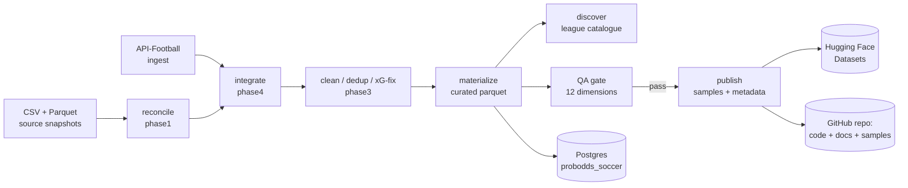

# Pipeline

This dataset is produced by a one-time, **re-runnable and idempotent** restoration pipeline
(not a scheduled service). Everything is regenerated by `scripts/restore.py`.

## Flow



## Stages

| Stage | Module | What it does |
|---|---|---|
| reconcile | `pipeline/phase1_reconcile.py` | Unify the CSV + Parquet snapshots by the consistent internal `id`; per-table richest-source merge; zero-orphan integrity. |
| ingest | `pipeline/phase4_run.py` | Fixtures-first ingest from API-Football (refresh existing + missing Cloudbet-covered leagues). |
| integrate | `pipeline/phase4_integrate.py` | Fold ingested fixtures/teams/leagues into staging (refresh by api id; new-entity ids offset by 100M). |
| clean | `pipeline/phase3_clean.py` | Entity dedup (teams) -> fixture dedup (business key) -> temporal (status/played/BTTS) -> xG fake-zero fix -> anomaly nulling. |
| materialize | `pipeline/materialize.py` | Write `build/curated/*.parquet` with the `known_at` leakage guard. |
| discover | `pipeline/phase4_discover.py` | Reconcile dataset x API-Football (1,235) x Cloudbet (285) into `league_catalogue`. |
| qa | `pipeline/qa.py` (+ `qa_pandera.py`) | 12-dimension QA + Cloudbet gate; emits `QUALITY_REPORT.md`. Blocking failures abort publish. |
| publish | `pipeline/phase6_publish.py` | Samples, `datapackage.json`, Croissant, data dictionary, README, HF card, CHANGELOG. |

## Run

```bash
pip install -r requirements.txt
python scripts/restore.py                # reconcile -> ... -> qa -> publish (skips API ingest)
python scripts/restore.py --with-ingest  # also refresh/ingest from API-Football
python scripts/restore.py --stages qa    # a single stage
```

Secrets (API-Football, Hugging Face, Cloudbet) are read at runtime from an out-of-repo file and
are never printed or committed.

## Key design decisions

- **Internal `id` is consistent across the two source snapshots** (verified: where
  `api_football_id` matches, the ids match), so snapshots are unioned rather than one being
  discarded — neither is a superset.
- **xG is nulled, never zero-imputed**, for league-seasons API-Football does not cover for xG
  (detected via the fraction of exact both-zero rows per league-year).
- **great_expectations is intentionally not used** (it cannot build on Python 3.14); the 12
  dimensions are covered by DuckDB SQL + pandera contracts + Frictionless.

## Entity relationships

```
leagues (1) --< fixtures (many)
teams   (1) --< fixtures.home_team_id / away_team_id
fixtures (1) --< match_stats (0..1)
fixtures (1) --< odds (0..n, per bookmaker)
fixtures (1) --< fixture_lineups (0..2)
fixtures (1) --< fixture_players (many) >-- players (1)
fixture_players (1) --< fixture_players_stats_flat (0..1)
```
