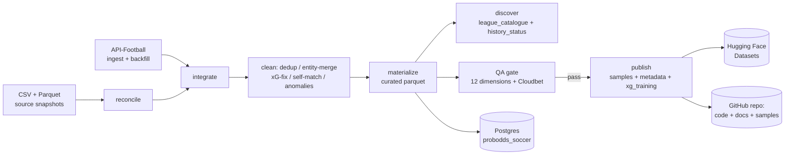

# Pipeline

This dataset is produced by a one-time, **re-runnable and idempotent** restoration pipeline
(not a scheduled service). Everything is regenerated by `scripts/restore.py`.

## Flow



## Stages

Run in order by `scripts/restore.py`. API stages only run with `--with-ingest`.

| Stage | Module | What it does |
|---|---|---|
| reconcile | `pipeline/phase1_reconcile.py` | Unify the CSV + Parquet snapshots by the consistent internal `id`; per-table richest-source merge; zero-orphan integrity. |
| ingest | `pipeline/phase4_run.py` | Fixtures-first ingest from API-Football (refresh existing + missing Cloudbet-covered leagues). |
| backfill_fixtures | `pipeline/phase4_backfill.py` | Backfill every in-dataset league's **full available history** — but only its *missing* seasons (compare present calendar years vs API-Football availability). Resilient: per-league-season errors are logged, not fatal. |
| backfill_stats | `pipeline/phase4_backfill_stats.py` | Parallel, rate-limited (900/min), **resumable** per-fixture `/fixtures/statistics` (real xG) + `/fixtures/lineups` for stats-covered league-seasons. |
| integrate | `pipeline/phase4_integrate.py` | Fold ingested fixtures/teams/leagues + backfilled match_stats/lineups into staging (refresh by api id; new-entity ids offset by 100M). |
| clean | `pipeline/phase3_clean.py` | Entity dedup (teams) → fixture dedup (business key) → temporal (status/played/BTTS) → xG fake-zero fix → anomaly nulling → **self-match drop** (`home_team_id = away_team_id`). |
| materialize | `pipeline/materialize.py` | Write `build/curated/*.parquet` with the `known_at` leakage guard; exclude self-match fixtures from the player tables. |
| discover | `pipeline/phase4_discover.py` | Reconcile dataset x API-Football (1,235) x Cloudbet (285) into `league_catalogue`, incl. per-league `history_status` (full / recent_only / partial). |
| qa | `pipeline/qa.py` (+ `qa_pandera.py`) | 12-dimension QA + Cloudbet-coverage gate (50+ blocking checks); emits `QUALITY_REPORT.md`. Blocking failures abort publish. |
| publish | `pipeline/phase6_publish.py` | Build `xg_training.parquet`; write samples, `datapackage.json`, Croissant, data dictionary, README, HF card, CHANGELOG. |

Postgres migration + parquet export to `probodds_soccer` is a separate step
(`scripts/migrate_postgres.py`, run on the DB host); HF upload is `scripts/upload_hf.py`.

## Run

```bash
pip install -r requirements.txt
python scripts/restore.py                # reconcile -> ... -> qa -> publish (skips API stages)
python scripts/restore.py --with-ingest  # also ingest + full-history backfill from API-Football
python scripts/restore.py --stages qa    # a single stage
```

Secrets (API-Football, Hugging Face, Cloudbet) are read at runtime from an out-of-repo file and
are never printed or committed.

## Key design decisions

- **Internal `id` is consistent across the two source snapshots** (verified: where
  `api_football_id` matches, the ids match), so snapshots are unioned rather than one being
  discarded — neither is a superset.
- **xG is nulled, never zero-imputed**, for league-seasons API-Football does not cover for xG
  (detected via the fraction of exact both-zero rows per league-year). Provider xG is itself a
  coarse shots-by-zone estimate (`~0.115*inside + 0.035*outside + 0.648*pen`, R^2~1.0), not a
  per-shot model — documented so it isn't over-trusted.
- **Backfill only fetches *missing* seasons** (present-vs-available diff), so re-runs are cheap
  and don't redundantly re-pull complete leagues.
- **Upstream entity over-merges are dropped, not trusted**: 25 "team-plays-itself" fixtures
  (from a provider club merger) are removed with an audit trail and a permanent QA gate.
- **great_expectations is intentionally not used** (it cannot build on Python 3.14); the 12
  dimensions are covered by DuckDB SQL + pandera contracts + Frictionless.

## Entity relationships

```
leagues (1) --< fixtures (many)
teams   (1) --< fixtures.home_team_id / away_team_id
fixtures (1) --< match_stats (0..1)
fixtures (1) --< odds (0..n, per bookmaker)
fixtures (1) --< fixture_lineups (0..2)
fixtures (1) --< fixture_players (many) >-- players (1)
fixture_players (1) --< fixture_players_stats_flat (0..1)
```
